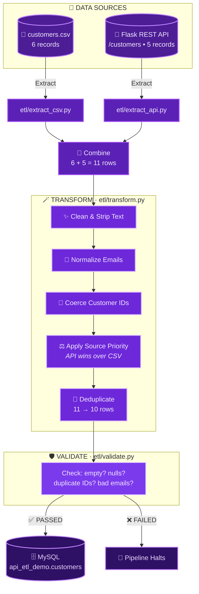
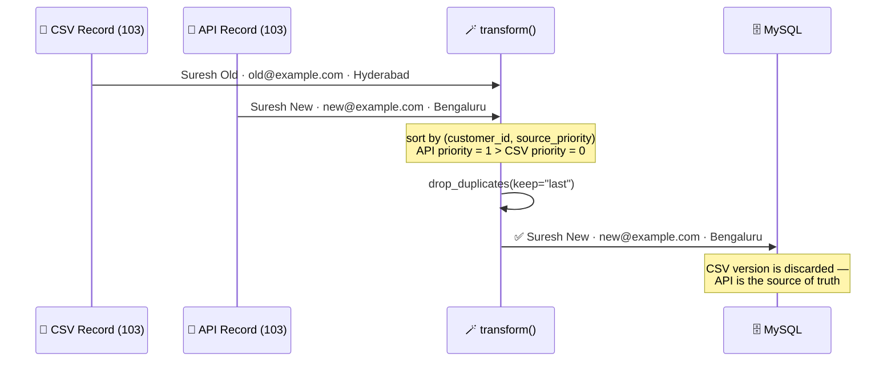
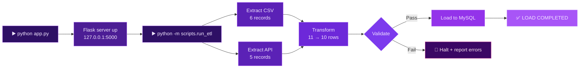

<div align="center">


<br/>

[](#)
[](#)
[](#)
[](#)
[](#)


</div>

<br/>

## 🔮 What is DataWeave?

> Two messy, disconnected data sources walk into a pipeline... and leave as **one clean, validated, deduplicated dataset.**

**DataWeave** is a hands-on, fully-documented **ETL (Extract → Transform → Load)** pipeline that shows what actually happens when data engineers merge data from multiple systems in the real world — a legacy **CSV export** and a live **REST API** — clean it with **Pandas**, enforce **business rules + validation**, and load it safely into **MySQL**.

No black boxes. Every transformation, every dedup rule, every validation check is broken down step-by-step.

<table>
<tr>
<td width="50%" valign="top">

### 🧵 The Problem
Real companies pull customer data from:
- 🗂️ Legacy databases → **CSV**
- 🌐 CRMs / websites → **API**
- 📊 Marketing tools → Excel

...and it's full of duplicates, casing chaos, stray whitespace, and broken emails.

</td>
<td width="50%" valign="top">

### 🧶 The Solution
```
Collect → Clean → Combine
   → Validate → Store
```
A single, testable, modular pipeline — the same shape used in production data platforms.

</td>
</tr>
</table>

---

## 🕸️ Architecture at a Glance



---

## 🧿 The Deduplication Rule — API Always Wins

The heart of `transform.py`. When the same `customer_id` appears in **both** sources, the API record is treated as the freshest truth.



---

## 🌠 Full Execution Flow



---

## 🪐 Project Structure

```
api_etl_project-main/
│
├── 🌸 app.py                     # Flask REST API (the second data source)
├── 📜 requirements.txt
├── 🔐 .env / .env.example
│
├── 📁 data/
│   ├── api_customers.json       # API's backing store (5 records)
│   └── customers.csv            # Legacy export (6 records)
│
├── 🧪 etl/
│   ├── extract_csv.py           # Reads + schema-checks the CSV
│   ├── extract_api.py           # Calls the API, handles timeouts/errors
│   ├── transform.py             # Combine · clean · dedupe (the heart 💜)
│   ├── validate.py              # Quality gate before loading
│   └── load.py                  # SQLAlchemy → MySQL
│
├── 🚀 scripts/
│   └── run_etl.py               # Orchestrator — runs every stage in order
│
├── 🗃️ sql/
│   ├── 01_create_database.sql
│   └── 02_validation_queries.sql
│
└── 🧵 tests/
    ├── test_api.py              # Flask endpoint tests
    ├── test_etl.py              # Proves "API wins" dedup rule
    └── test_validation.py       # Quality-check tests
```

---

## 🔬 Tech Stack

<div align="center">

| Layer | Technology | Why |
|:--|:--|:--|
| 🌐 API | **Flask** | Lightweight REST layer simulating a real CRM/website source |
| 🐼 Transform | **Pandas** | Combine, clean, normalize, deduplicate at scale |
| 🔗 HTTP | **Requests** | Talks to the Flask API with timeout protection |
| 🗄️ Database | **MySQL** | Final structured destination, `customer_id` as primary key |
| 🧩 ORM | **SQLAlchemy + PyMySQL** | Safe, pooled connection between Python and MySQL |
| 🔑 Config | **python-dotenv** | Keeps credentials out of source code |
| ✅ Testing | **Pytest** | 9 automated tests across API, transform, and validation |

</div>

---

## 🌙 API Reference

<div align="center">

| Method | Endpoint | Purpose | Success | Failure |
|:--|:--|:--|:--:|:--:|
| `GET` | `/health` | Liveness check | `200` | — |
| `GET` | `/customers` | List all (supports `?city=`) | `200` | — |
| `GET` | `/customers/<id>` | Fetch one customer | `200` | `404` |
| `POST` | `/customers` | Create a customer | `201` | `400` / `409` |
| `PUT` | `/customers/<id>` | Update fields (merge patch) | `200` | `404` |
| `DELETE` | `/customers/<id>` | Remove a customer | `204` | `404` |

</div>

---

## 🛡️ Validation Gate

Before anything touches MySQL, every row must survive:

- 🚫 **Not empty** — the dataset itself can't be blank
- 🆔 **No null `customer_id`** — it's the primary key
- 🧬 **No duplicate IDs** — uniqueness is non-negotiable
- ✍️ **Required text fields present** — name, city, state
- 📧 **Valid email format** — checked via regex `^[^@\s]+@[^@\s]+\.[^@\s]+$`

```
Transform → Validate → Load
     (never Load → "oops, bad data" 🙅‍♀️)
```

---

## 📈 Sample Run

<div align="center">

```
════════════════════════════════════════════════════════
   CSV + API → Pandas → MySQL ETL
════════════════════════════════════════════════════════
CSV records: 6
API records: 5
Final records after deduplication: 10
VALIDATION PASSED
LOAD COMPLETED
```

```
✅ 9 passed in 5s
```

</div>

---

## ⚡ Quickstart

```bash
# 1️⃣ Create + activate a virtual environment
python -m venv venv
venv\Scripts\activate          # Windows PowerShell

# 2️⃣ Install dependencies
pip install -r requirements.txt

# 3️⃣ Configure environment
cp .env.example .env           # then set your MySQL password

# 4️⃣ Create the database
mysql -u root -p < sql/01_create_database.sql

# 5️⃣ Start the API   (Terminal 1 — keep running)
python app.py

# 6️⃣ Run the pipeline   (Terminal 2)
python -m scripts.run_etl

# 7️⃣ Run the test suite
pytest -q
```

---

## 🔮 Roadmap

<table>
<tr>
<td valign="top" width="33%">

**⚙️ Engineering**
- Database upserts
- Retry mechanisms
- Structured logging
- API authentication

</td>
<td valign="top" width="33%">

**☁️ Infrastructure**
- Docker containers
- Airflow / Prefect scheduling
- Cloud deployment (AWS/Azure/GCP)
- CI/CD via GitHub Actions

</td>
<td valign="top" width="33%">

**📊 Visibility**
- React dashboard
- Data quality metrics
- Pipeline run history
- Monitoring & alerts

</td>
</tr>
</table>

---

## 💜 One-Minute Interview Summary

> A Python-based ETL pipeline that merges customer data from a CSV file and a Flask REST API. Pandas handles cleaning, email/ID normalization, and deduplication — with the API treated as the source of truth for conflicting records. Before loading, the pipeline runs quality checks for nulls, duplicate keys, and malformed emails, then loads the validated dataset into MySQL via SQLAlchemy — all backed by an automated Pytest suite covering the API, transformation logic, and validation rules.

<br/>

<div align="center">


**Extract → Transform → Load, woven with 💜**

</div>
